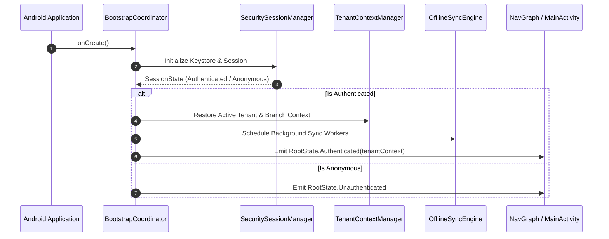
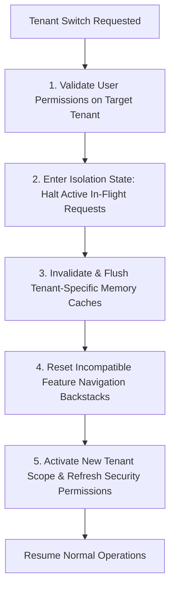

# ZenOS Application Lifecycle & State Governance
**Document Version:** 1.0.0  
**Target Maturity:** 9.5/10 Enterprise Platform Standard  
**Scope:** Bootstrap, Session Lifecycles, Tenant Transitions, State Restoration

---

## 1. Application Bootstrap & Initialization Pipeline

Application startup must be deterministic, asynchronous, and resilient against cold-start bottlenecks:



---

## 2. State Ownership & Scoping Matrix

| State Category | Owner | Lifetime / Scope | Restoration Policy |
|:---|:---|:---|:---|
| **Ephemeral UI State** | Composable (`remember`, `rememberSaveable`) | Active Composable node | Saved via `SavedStateHandle` on process death |
| **Screen Business State** | ViewModel (`StateFlow<UiState>`) | NavBackStackEntry lifecycle | Restored via SavedStateHandle + Initial Intent |
| **Feature Workflow State** | Workflow Coordinator / UseCase | Multi-step wizard or flow | Persisted in Local Room Draft table |
| **Authentication Session** | `SessionManager` (Singleton) | Active user login session | Encrypted in Android Keystore / EncryptedSharedPreferences |
| **Tenant & Branch Context** | `TenantContextManager` (Singleton) | Active selected organization | Persisted in secure settings |
| **Server Cache State** | Repository Cache Layer | Cache Policy (TTL / ETag) | Partitioned by `tenant_id` |
| **Pending Offline Operations** | `OfflineSyncEngine` | Persistent database queue | Persisted until server confirmation / reconciliation |

---

## 3. Tenant Context Switching Protocol (P0 Security Critical)

Switching organizations or branches **cannot** be a simple variable assignment. It must follow a strict 5-stage transition pipeline to prevent cross-tenant data leaks:



### Kotlin Contract: `TenantContextManager`

```kotlin
interface TenantContextManager {
    val activeTenant: StateFlow<TenantContext?>
    
    suspend fun switchTenant(
        targetTenantId: String,
        targetBranchId: String?
    ): Result<TenantSwitchResult>
}

data class TenantContext(
    val tenantId: String,
    val organizationName: String,
    val activeBranchId: String?,
    val permissions: Set<PermissionKey>,
    val switchedAtEpochMillis: Long
)
```

---

## 4. Session Expiration & Global Error Recovery

When a 401 Unauthorized or Token Revocation occurs during an active workflow:
1. **Network Interceptor** catches 401 and attempts silent token refresh with mutex lock.
2. If refresh fails:
   - Emits `SessionEffect.SessionExpired` via global `SessionEventsChannel`.
   - Halts all pending synchronization.
   - Clears ephemeral in-memory caches (keeps encrypted offline queue bound to `tenantId`).
   - Smoothly redirects `NavHost` to `LoginRoute` with an explanatory toast: `"Session expired. Please sign in to continue."`.
