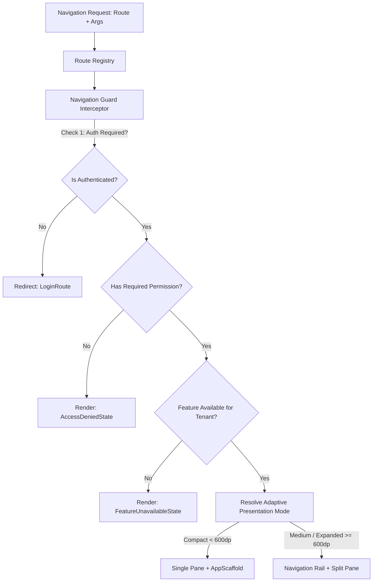

# ZenOS Declarative Navigation Architecture & Platform Contracts
**Document Version:** 1.0.0  
**Target Maturity:** 9.5/10 Enterprise Platform Standard  
**Scope:** Typed Routes, Route Guards, Adaptive Multi-Pane, Deep Links

---

## 1. Declarative Navigation Architecture

ZenOS treats navigation as an **application-level platform subsystem** rather than a collection of string routes.



---

## 2. Standardized Route Metadata Contract

Every feature declares its destinations implementing `ZenOsRoute`:

```kotlin
sealed interface ZenOsRoute {
    val routePattern: String
    val requiresAuthentication: Boolean get() = true
    val requiredPermissions: Set<String> get() = emptySet()
    val requiredFeatureFlag: String? get() = null
    val presentationMode: PresentationMode get() = PresentationMode.STANDARD
    val deepLinkUriPattern: String? get() = null
}

enum class PresentationMode {
    STANDARD,
    MODAL_BOTTOM_SHEET,
    FULL_SCREEN_DIALOG,
    SPLIT_PANE_DETAIL
}
```

### Example: Feature-Owned Typed Route

```kotlin
object EmployeeRoutes {
    data object List : ZenOsRoute {
        override val routePattern: String = "employees"
        override val requiredPermissions = setOf("employees.read")
    }

    data class Detail(val employeeId: String) : ZenOsRoute {
        override val routePattern: String = "employees/{employeeId}"
        override val requiredPermissions = setOf("employees.read")
        override val presentationMode = PresentationMode.SPLIT_PANE_DETAIL
        override val deepLinkUriPattern = "zenos://hrmis/employees/{employeeId}"
    }
}
```

---

## 3. Navigation Guard System

Guards execute asynchronously before navigation completes:

```kotlin
interface NavigationGuard {
    suspend fun evaluate(
        targetRoute: ZenOsRoute,
        tenantContext: TenantContext?,
        authState: AuthState
    ): GuardDecision
}

sealed interface GuardDecision {
    data object Allow : GuardDecision
    data class Redirect(val destinationRoute: String) : GuardDecision
    data class BlockWithAlert(val reason: String) : GuardDecision
}
```

---

## 4. Adaptive Navigation Integration (Form-Factor Aware)

The navigation system inspects `WindowAdaptiveInfo` to choose presentation modes:

| Window Class | Width DP | Primary Navigation Pattern | Content Structure |
|:---|:---|:---|:---|
| **Compact** | `< 600dp` | `AppBottomBar` (Auto-hide on scroll) | Single Pane (Stack Navigation) |
| **Medium (Foldables)** | `600dp - 839dp` | `NavigationRail` (Left edge) | Two-Pane / Master-Detail |
| **Expanded (Tablets/PC)** | `>= 840dp` | `NavigationRail` or Permanent Drawer | Multi-Column Adaptive Scaffolding |
